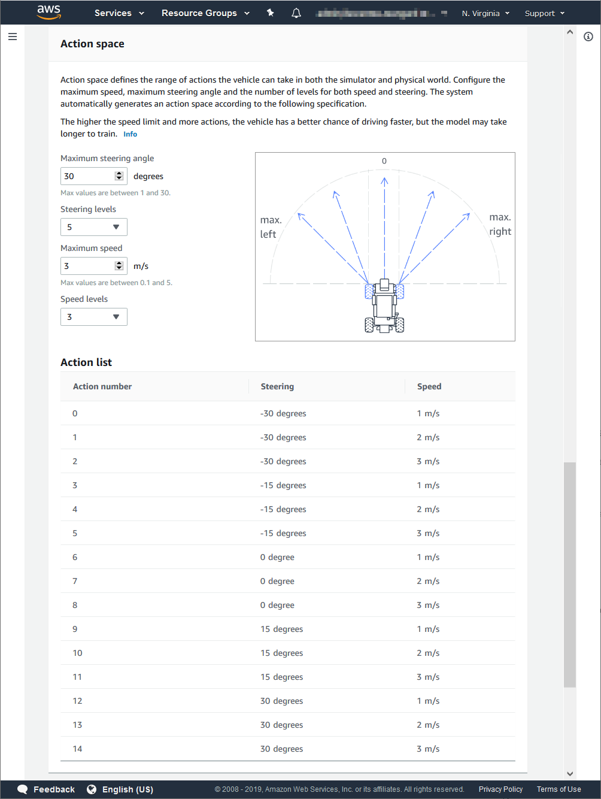
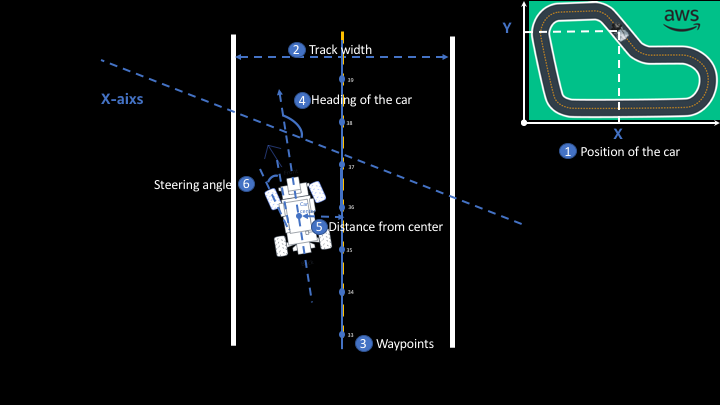
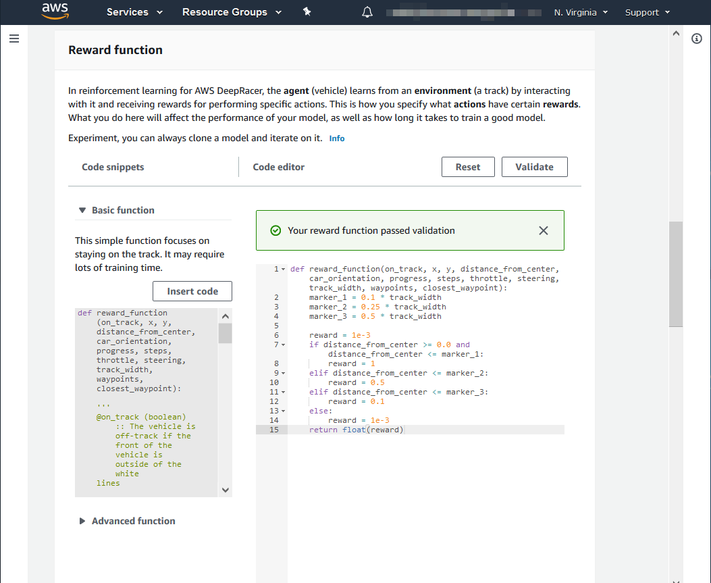
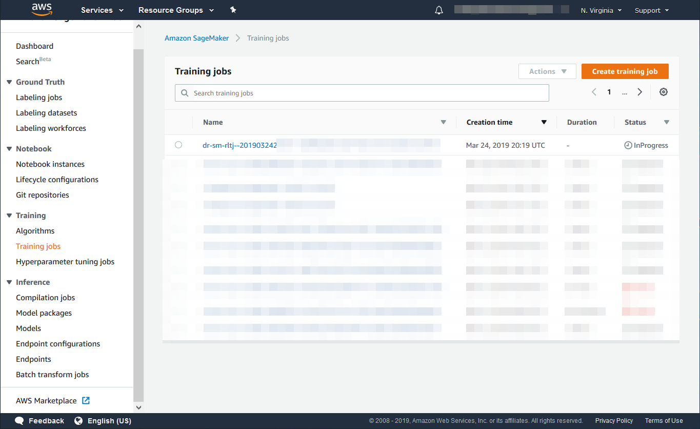
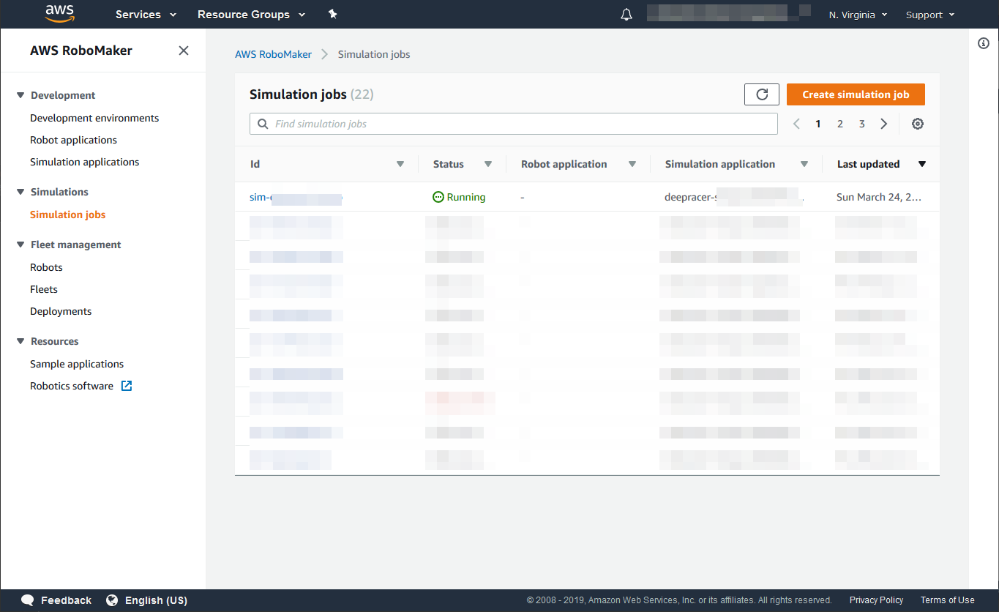
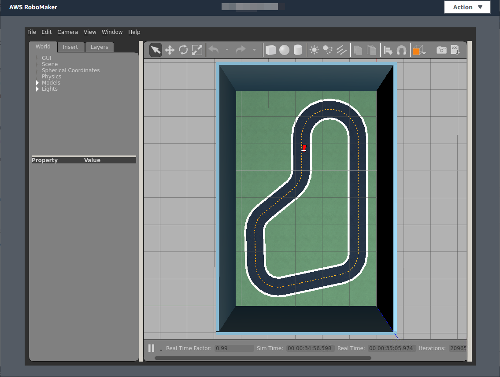

# Lab 1: AWS DeepRacer 강화학습(RL) 모델을 만들어봅시다!

# Notes

AWS는 고객분들께서 보다 나은 경험을 하실 수 있도록 AWS DeepRacer 서비스를 개선하는데 끊임없이 노력하고 있습니다. 따라서 항상 GitHub의 최신 실습용 자료를 참고하시기 바랍니다. 이전 버전의 내용는 유효기간이 지났을 수 있습니다. 기술적인 질문이 있으시면 워크숍 진행자에게 문의하시기 바랍니다. 집에서 실습을 진행하시는 분들은 [AWS DeepRacer forum](https://forums.aws.amazon.com/forum.jspa?forumID=318)에 질문을 올려주시기 바랍니다. 

# Overview

이 랩의 목표는 다음과 같습니다:

1. AWS 콘솔에서 제공하는 AWS DeepRacer 서비스를 잘 배우고 익힙니다. 
2. 모델 트레이닝을 시작하는데 필요한 개념을 설명합니다. 
3. DeepRacer League에 어떻게 참가하고, 순위를 위해 어떻게 경쟁하면 되는지 설명합니다. 
4. 여러분이 만든 모델을 향상시킬 수 있는 방법을 설명합니다. 

랩은 크게 3개의 섹션으로 구성되어 있습니다:

1. Section 1: 첫 번째 모델 트레이닝
2. Section 2: AWS DeepRacer League에서 경쟁
3. Section 3: 모델 트레이닝 및 모델 개선

목표 1과 2는 Section 1에서 다룹니다. 목표 3은 Section 2에서, 그리고 목표 4는 Section 3에서 다룹니다. 

# Format

랩을 완료하기 위한 소요 시간은 약 50분 정도입니다. 내용를 충분히 읽고 이해하고, 서비스 기능과 동작 방식 등을 잘 파악해서 첫 번째 AWS DeepRacer 강화학습(RL) 모델 트레이닝을 시작하기에는 충분한 시간이라고 생각됩니다. Section 1 은 약 25~35 분 정도 소요됩니다. Section 2 는 약 5분 정도 소요되며, Section 3 은 이 워크숍 시간보다 훨씬 더 많은 시간이 걸릴 수 있습니다(하지만 이 Section은 집에서 실습하는 용도임을 참고하시기 바랍니다). 

이 랩을 통해 여러분은 AWS DeepRacer 서비스의 다양한 구성 요소에 대한 자세한 정보를 AWS 콘솔에서 테스트하고 확인할 수 있을 것입니다. Section 1 마지막 단계에서 모델 트레이닝을 시작합니다.

# Hints

- 트레이닝 잡(job)을 시작하고 싶으시다면, 모델 트레이닝을 시작하기에 앞서 충분한 시간을 들여서 개념을 먼저 숙지 하시기 바랍니다. 
- 랩을 진행하면서 질문도 하시고, 테이블에서 다른 분들과의 의견 교환도 자유롭게 하시기 바랍니다. 
- 끝으로, 트레이닝 작업을 시작할 때 적어도 60~90분 정도 실행하시기 바랍니다. 필요한 서비스를 시작하려면 약 6분 정도 기다리셔야 합니다. 여러분의 모델이 어느정도 시간을 들여 트랙을 탐색한 후 랩을 완료할 것입니다.
- 랩을 완료하신 후에도 관련 내용을 계속 학습하고 싶으시면, AWS Training and Certification 팀에서 제공하는 신규 교육 프로그램인 [AWS DeepRacer: Driven by Reinforcement Learning](https://www.aws.training/learningobject/wbc?id=32143) 을 확인해보시기 바랍니다.

# Section 1: 첫 번째 모델 트레이닝

## Step 1: AWS DeepRacer 서비스로 로그인

여러분에게 제공된 계정 정보를 이용하여 [AWS Console](https://signin.aws.amazon.com/signin?redirect_uri=https%3A%2F%2Fconsole.aws.amazon.com%2Fconsole%2Fhome%3Fnc2%3Dh_ct%26src%3Dheader-signin%26state%3DhashArgs%2523%26isauthcode%3Dtrue&client_id=arn%3Aaws%3Aiam%3A%3A015428540659%3Auser%2Fhomepage&forceMobileApp=0) 에 로그인 합니다. 

리전(Region)이 **North Virginia** 인지 확인하고 [AWS DeepRacer](https://console.aws.amazon.com/deepracer/home?region=us-east-1)(<https://console.aws.amazon.com/deepracer/home?region=us-east-1>)로 이동합니다. 

AWS DeepRacer 페이지에서, 왼쪽 메뉴의 **Reinforcement learning**를 선택합니다.

## Step 2: 모델 목록 페이지

Reinforcement learning 메뉴를 선택하면 모델 페이지가 나타날 것입니다. 이 페이지를 통해 여러분이 만든 모든 모델 목록과 각 모델의 상태(status)를 확인할 수 있습니다. 이 페이지에서 모델 생성 프로세스를 시작하시면 됩니다. 뿐만 아니라, 모델 다운로드, 복제, 삭제도 이 페이지에서 하실 수 있습니다.


모델이 없을 경우 목록에는 아무것도 안 나타날 것입니다. 여기서 **Create model** 버튼을 클릭해서 모델을 만들 수 있습니다. 모델을 생성한 후에는 이 페이지를 통해 학습 중(Training), 완료(Ready) 등 모델의 상태(status)를 확인할 수 있습니다. 모델의 상태(status)가 "완료(Ready)"이면 모델 트레이닝이 완료되었음을 의미하는 것으로, 모델을 다운로드 하거나 테스트(evaluate)할 수 있습니다. 뿐만 아니라, 가상의 레이스에 모델을 제출할 수도 있습니다. **Model details** 페이지로 이동하고 싶으시면 모델 이름을 클릭하시면 됩니다. 

첫 번째 모델을 만들려면 **Create model**을 선택하시면 됩니다. 

## Step 3: Create model
이 페이지에서는 AWS DeepRacer용 RL 모델을 만들고 모델 학습을 시작하는 것을 배웁니다. 이 페이지는 몇 개의 섹션이 있습니다. LAB을 시작하기 앞서 먼저 스크롤 다운 하여 어떤 내용들이 있는지 확인해 봅니다. 여기서는 AWS DeepRacer 자동차가 스스로 트랙에서 자율 운행 하기 위해 사용 될 모델을 만들 것입니다. 그러기 위해서 제일 먼저 레이스 트랙을 선택하고, 모델이 선택 할 수 있는 행동들을 정의하고, 원하는 운전 행동을 장려하기 위해 사용할 보상 함수(reward function)을 디자인 하고, 학습 중에 사용되는 하이퍼파라미터를 조정 할 것입니다. 

### **Info 버튼들**
콘솔 안에서 해당 **Info** 버튼을 누르면, information 창이 스크린 오른 쪽에서부터 앞으로 나타 나게 됩니다.  Info 창은 창 안에서 별도 링크를 선택하지 않는 한 그대로 오른편에 남아있게 됩니다. 내용을 다 읽으신 뒤에는 창을 닫을 수 있습니다.

## 3.1 Model details
먼저 맨 위의 Model details부터 시작 합니다. 여기서는 모델 이름을 지정하고 모델에 대한 설명을 입력합니다. 서비스를 처음 사용하는 경우 **Create Resources** 버튼을 선택합니다. 이렇게 하면 AWS DeepRacer가 사용자를 대신해서 다른 AWS 서비스를 호출하는 데 필요한 IAM 역할, 학습 및 검증에 사용되는 VPC 스택, 보상 함수를 검증하기 위해 Python 3로 쓰여진 AWS DeepRacer Lambda 함수, 그리고 학습이 끝난 모델이 저장될 AWS DeepRacer S3 버킷이 생성됩니다. 이 섹션에서 오류가 나면 저희에게 알려주십시오.


모델의 이름과 설명을 입력하고 다음 섹션으로 스크롤하십시오.

## 3.2 Environment simulation
워크샵에서 자세히 설명했듯이, RL 모델을 학습하는 것은 시뮬레이션 된 레이스 트랙에서 이루어지게 됩니다. 이 섹션에서는 모델을 학습시킬 트랙을 선택합니다. AWS RoboMaker는 시뮬레이션 환경을 구성하는데 사용됩니다. 

모델을 학습할 때는, 실제로 레이스하기를 원하는 트랙을 미리 생각해 보고 최종적으로 레이스 할 트랙과 가장 유사한 트랙을 선택하여 학습합니다. 꼭 필요하거나 좋은 모델을 보장하는 것은 아니지만, 이것은 모델이 레이스 트랙에서 최고의 성능을 발휘할 확률을 최대화할 것입니다. 예를 들면, 만약 직선 모양의 트랙을 선택하여 학습한다면 모델이 좌/우회전을 할거라고 기대할 수 없습니다.

Section 2에서 AWS DeepRacer League에 대한 자세한 내용을 제공할 예정이지만, 리그에서 경기하기 위해 학습할 트랙을 선택할 때는 유의해야 할 사항이 있습니다.

-  실제 레이스 트랙은 re:Invent 2018 트랙이 [Summit Circuit](https://aws.amazon.com/deepracer/summit-circuit/)이 될 것이므로 선택한 AWS Summit 중 어느 곳에서 경주를 하려고한다면 re:Invent 트랙에서 모델을 학습 시키십시오.

-  Virtual Circuit은 매번 새로운 경기용 트랙이 생기며, 이 경기용 트랙을 직접 학습할 수는 없습니다. 대신, 매 경기마다 완전히 동일하지는 않겠지만 유사한 트랙을 선보일 것입니다. 즉 자율 주행이 성공적이려면 모델이 일반화 되어야하며, 경기 트랙에 overfitting 되어서는 안됩니다.

오늘의 Lab에서는 시간이 가능한 한 최대로 여러분들이 Summit에서 레이스를 참가를 위해 준비 될 수 있도록 도와드릴 예정입니다. re:Invent 2018 트랙을 선택하고 다음 섹션으로 스크롤하십시오.

## 3.3 Action space
이 섹션에서는 학습 과정 및 실 주행에서 선택 할 수 있는 action space를 정의합니다. Action은 자동차가 취할 수 있는 스피드와 조향각의 조합입니다. AWS DeepRacer에서는 continuous action space가 아닌 discrete acation space를 사용합니다. 이 discrete action space를 정의하기 위해 최대 속도(maximum speed), 속도 레벨(speed levels), 최대 조향 각도(maximum steering angle), 그리고 조향 레벨 (steering levels) 을 지정하게 됩니다.



입력값들

- 최대 조향 각도는 차량의 앞 바퀴가 왼쪽과 오른쪽으로 회전 할 수있는 최대 각도입니다. 바퀴가 얼마나 크게 회전 할 수 있는지에 대한 한계가 있으며, 최대 회전 각도는 30도입니다.
- 조향 레벨은 양쪽 최대 조향 각도 사이가 몇 단계인지를 나타냅니다. 따라서 최대 조향 각도가 30도인 경우 + 30도가 왼쪽이고 -30도가 오른쪽입니다. 조향 레벨이 5인 경우 왼쪽에서 오른쪽 방향으로 30도, 15도, 0도, -15도 및 -30 도의 조향 각도가 동작 공간에 표시됩니다.  조향 각도은 언제나 0도를 기준으로 대칭입니다.
- 최대 속도는 자동차가 시뮬레이터에서 운전할 최대 속도를 m/s로 측정 한 것입니다.
- 속도 레벨은 최대 속도(포함)에서 0까지의 속도 레벨의 개수를 나타냅니다. 만약 최대 속도가 3m/s이고 속도 레벨이 3이라면, action space에는 1m/s, 2m/s, 3m/s의 속도가 포함됩니다. 간단히 3m/s 를 3으로 나누면 1m/s가 되고,  0m/s 에서 3m/s로 1m/s씩 증가합니다. 0m/s는 action space에 포함되지 않습니다.

위의 예시에서, 최종 action space는 총 15개(3 단계 속도 x 5 단계 조향 각도)의 개별 action으로 이루어집니다. 아직 완료하지 않았다면 지금 action space를 구성하십시오. 자유롭게 구성하되, 큰 action space는 학습이 더 오래 걸릴 수 있음을 기억하세요.

힌트

- 모델은 action space에 없는 행동을 수행하지 않습니다. 어떤 모델이 특정 행동이 필요 없는 트랙에서 학습되었다면 (예 : 좌/우회전을 보상받지 못하는 직선 트랙), 그 행동을 언제 사용해야 할지 모를 것입니다. 따라서 안정적인 모델을 설계하려면 action space와 학습 트랙을 염두에 두십시오.
- 빠른 속도 또는 넓은 조향각을 지정하는 것은 좋지만, 여러분의 보상 함수에서 전속력으로 회전 구간을 운전하는 것 또는 직선 구간에서 지그재그로 움직이는 것이 적절한지 생각해 봐야 합니다.
- 실제 경주의 경우, 자동차가 시뮬레이터에서 배운 것보다 더 빨리 주행하지 못하도록 AWS DeepRacer의 웹 서버 사용자 인터페이스에서 Throttle 값을 조절해야 합니다.


## 3.4 Reward function

강화 학습에서는 보상 함수(reward function)를 잘 설계하는 것이 이 모델 학습에 **중요한 역할**을 합니다. 보상 함수는 학습된 RL 모델이 자율 주행을 할 때 우리가 원하는 바대로 행동 할 수 있도록 좋은 운전 행동을 장려하는 데 사용됩니다.

보상 함수는 행동 결과의 품질을 평가하고 그에 따라 보상합니다. 보상은 학습을 수행하는 동안 각 행동을 취한 후에 시뮬레이션에서 계산됩니다. 보상 함수에 들어갈 로직은 여러분이 Python 3 문법으로 직접 채워 넣습니다. 보상 함수를 코딩할 때, 시뮬레이션에서 얻은 여러 측정 값들을 변수로 사용할 수 있습니다. 

아래는 보상 함수에 사용할 수 있는 변수들의 목록입니다. 저희들이 더 좋은 방법을 찾을 때마다 아래 목록을 종종 업데이트한다는 점을 기억해 두세요. 그럴 때마다 여러분의 보상함수를 적절히 수정하십시오. Seoul 워크샵에서는 아래의 변수들이 AWS DeepRacer 콘솔에서 현재 사용 가능합니다. 혹시 AWS DeepRacer 서비스에서 간혹 다르게 설명 되어 있다면 이를 무시하고, 아래의 변수 이름과 설명을 사용하십시오. 가장 두드러진 차이점은 Throttle과 Steering 입니다.

| 변수 이름            | 타입                     | 설명                                                         |
| -------------------- | ------------------------ | ------------------------------------------------------------ |
| on_track             | boolean                  | 4개의 바퀴 중 하나라도 도로 표면과 경계선으로 정의된 트랙에 있으면 on_track은 True 입니다. 4개의 바퀴가 모두 트랙에서 벗어난 경우 on_track은 False입니다. on_track이 False이면 차량이 리셋됩니다. |
| x                    | Float                    | 자동차의 차축 중심의 x 좌표를 미터로 반환합니다.             |
| y                    | Float                    | 자동차의 차축 중심의 y 좌표를 미터로 반환합니다.             |
| distance_from_center | Float [0, track_width/2] | 트랙 중심으로부터 절대 거리. 트랙의 중심은 모든 waypoint를 연결하는 선에 의해 결정됩니다. |
| car_orientation      | Float [-pi,pi]           | 자동차가 향하는 방향을 Radian 단위로 반환합니다. 차가 x가 증가하는 방향으로 향하고 y가 일정하다면 0을 반환합니다. 차가 y가 증가하는 방향으로 향하고 x가 일정하면 pi/2를 반환합니다. 차가 y가 감소하는 방향으로 향하고 x가 일정하면 -pi/2를 반환합니다. |
| progress             | Float [0,100]            | 트랙 주행 완료 백분율.                                       |
| steps                | Integer                  | 완료된 스텝 수. 한 스텝은 (state, action, next state, reward)의 튜플 입니다. |
| throttle             | Float                    | 초당 미터 단위의 자동차 속도. 이것은 선택된 action space와 관련 있습니다. |
| steering             | Float                    | Radian 단위의 원하는 자동차의 조향 각도. 이것은 선택된 action space와 관련있으며 (degree가 아니라) Radian으로 표현 됩니다. 양수(+) 각도는 왼쪽으로, 음수(-) 각도는 오른쪽으로 진행함을 나타냅니다. 이것은 2D 기하학적 처리와 관련 있습니다. |
| track_width          | Float                    | 트랙의 폭 (미터 단위)                                        |
| waypoints            | List                     | 트랙 중앙을 따라 있는 waypoint들의 (x,y) 좌표 목록(ordered list). 리스트의 인덱스는 0부터 시작함. |
| closest_waypoint     | Integer                  | 직선 거리로 측정한, 가장 가까운 waypoint의 인덱스. 이 waypoint는 차의 앞쪽에 있을 수도, 뒤쪽에 있을 수도 있습니다. |

보상 함수에서 사용할 수 있는 변수들을 설명하는 그림입니다.



아래는 re:Invent track 에서 사용 되는 waypoints에 대한 그림입니다. 보상 함수에서는 중심선의 waypoint만 사용할 수 있습니다. 아래의 그래프는 보상 함수에서 waypoint 값을 print한 후, 이를 plot하여 얻을 수 있습니다. 보상 함수에서 print 함수를 사용하면, 출력이 AWS RoboMaker의 로그에 저장됩니다. 다른 트랙들에 대해서도 마찬가지로 그려 볼 수 있습니다. 로그들에 대해서는 다음에 논의 할 것입니다.


보상 함수를 설계하는 방법은, 잘 주행하는 자동차의 행동에 대해 생각해 보는 것입니다. 간단한 예로, 트랙 위에 머무르면 자동차에게 보상을 주는 방법이 있습니다. 이는 항상 reward = 1 로 설정하면 됩니다. 이 방식은 시뮬레이터에서 잘 동작을 할 것입니다. 왜냐하면, 자동차가 트랙에서 벗어났을 때는 리셋하고 출발점에서 다시 시작하기 때문에,  트랙에서 벗어난 경우 보상하는 것을 걱정할 필요가 없기 때문입니다. 하지만 이것은, 좋은 보상 함수를 설계할 때 사용할 수 있는 다른 변수들을 완전히 무시하므로 최상의 보상 함수는 아닐 것입니다.

아래에서는 몇 가지 보상 함수의 예제를 보입니다.

**Example 1**: 중심선을 따라가도록 장려하는 보상 함수. 

여기에서는 먼저 3 개의 마커를 사용하여 트랙 주위에 3 개의 밴드를 만든 다음, 중심선에 가까운 좁은 밴드에서 주행 했을 때 더 많은 보상을 합니다. 보상 값의 크기 차이에도 유의하십시오. 우리는 좁은 밴드에 머무를 때 1, 중간 밴드에 머무를 때 0.5, 넓은 밴드에 머무를 때 0.1의 보상을 제공합니다. 좁은 밴드에 대한 보상을 줄이거나 중간 밴드에 대한 보상을 높인다면 차량이 트랙의 넓은 면을 사용하도록 유도하게 될 것입니다. 이것은 특히 급회전 구간이 있을 때 유용할 수 있습니다.

```python
def reward_function(on_track, x, y, distance_from_center, car_orientation, progress, steps, throttle, steering, track_width, waypoints, closest_waypoint):
	marker_1 = 0.1 * track_width
	marker_2 = 0.25 * track_width
	marker_3 = 0.5 * track_width

	reward = 1e-3
	if distance_from_center <= marker_1:
		reward = 1
	elif distance_from_center <= marker_2:
		reward = 0.5
	elif distance_from_center <= marker_3:
		reward = 0.1
	else:
		reward = 1e-3  
	return float(reward)
```

Hint: 보상을 0으로 주지 마십시오. 보상 값이 0일 때, 저희가 사용하는 옵티마이저(optimizer)가 어려움을 겪을 수 있습니다. 마지막 else 절에서 아주 작은 값을 사용하는 것은 그 이유 때문입니다.

**Example 2**: 과도한 조향에 페널티를 주고, 중심선을 따라가도록 유도하는 고급 보상 함수.


```python
def reward_function(on_track, x, y, distance_from_center, car_orientation, progress, steps, throttle, steering, track_width, waypoints, closest_waypoint):

	import math
	marker_1 = 0.1 * track_width
	marker_2 = 0.25 * track_width
	marker_3 = 0.5 * track_width

	reward = 1e-3
	if distance_from_center <= marker_1:
		reward = 1
	elif distance_from_center <= marker_2:
		reward = 0.5
	elif distance_from_center <= marker_3:
		reward = 0.1
	else:
		reward = 1e-3 

	# penalize reward if the car is steering way too much
	# steering angle is in radians in the reward function
	# assumes your action space maximum steering angle is 30 and you have a steering granularity of at least 5. We will penalize any steering action that requires more than 15 degrees, absolute.
	ABS_STEERING_THRESHOLD = math.radians(15)
	if abs(steering) > ABS_STEERING_THRESHOLD:
		reward *= 0.5

	return float(reward)        
```

**Example 3**: 저속 주행에 페널티를 중심선을 따라가도록 유도하는 고급 보상 함수.


```python
def reward_function(on_track, x, y, distance_from_center, car_orientation, progress, steps, throttle, steering, track_width, waypoints, closest_waypoint):

	import math
	marker_1 = 0.1 * track_width
	marker_2 = 0.25 * track_width
	marker_3 = 0.5 * track_width

	reward = 1e-3
	if distance_from_center <= marker_1:
		reward = 1
	elif distance_from_center <= marker_2:
		reward = 0.5
	elif distance_from_center <= marker_3:
		reward = 0.1
	else:
		reward = 1e-3 

	# penalize reward for the car taking slow actions
	# throttle is in m/s
	# the below assumes your action space has a maximum speed of 5 m/s and speed granularity of 3
	# we penalize any throttle less than 2m/s
	THROTTLE_THRESHOLD = 2
	if throttle < THROTTLE_THRESHOLD:
		reward *= 0.5

	return float(reward)
```

이제 위의 예제들을 사용해 여러분의 보상 함수를 만들어 봅시다. 다음은 몇 가지 추가 Tip 입니다:
- waypoints 를 사용하여 한 waypoint 에서 다음 waypoint 로의 방향을 계산할 수 있습니다.
- 보상을 기하 급수로 조정할 수 있으나 최대 10,000으로 제한하십시오.
- 보상 함수에서 throttle 과 steering을 사용할 때 action space를 염두에 두십시오.
- Python에서 degree를 radians로 변환하기 하려면, import math를 실행하고 math.radians를 사용합니다.
- 자동차가 완주할 경우의 episode를 로그에서 추적하려면 progress가 100일 때 완주 보너스(예: rewards += 10000)를 줄 수 있습니다. 자동차가 완주했을 때 progress는 0으로 리셋되고 새로운 episode를 시작하면서 시뮬레이션은 계속 진행이 될 것이기 때문입니다. 이 모델은 stopping time에 도달 할 때까지 계속 학습합니다. 하지만, 최종 모델이 최고의 모델이라는 것을 의미하지는 않습니다. 특히 이 모델을 사용해서 현실 세계에서 레이스를 할 때 그렇습니다. 보다 편하게 추적하는 방법을 제공할 예정입니다.

보상 함수를 만들고 나서, **Validate** 버튼을 사용하여 학습을 시작하기 전에 코드 구문이 올바른지 확인하십시오. 학습을 시작하면 보상 함수가 파일로 S3에 저장되지만, 안전하게 따로 복사해 저장해 두는 것도 좋습니다.

위의 첫 번째 예제를 사용한 보상 함수가 있습니다



다음 섹션으로 스크롤 하세요. 

## 3.5 알고리즘 세팅

이 섹션에서는 학습 중 강화 학습 알고리즘에서 사용할 하이퍼 파라미터를 지정합니다. 하이퍼 파라미터는 학습 성과를 향상시키는 데 사용됩니다.

깊이 들어가기 전에, 여러분이 그 의미에 대해 잘 알고 있는지 확인하기 위해서 앞으로 사용하게될 몇 가지 용어를 설명하겠습니다.

**스텝(step)**은 경험이라고도 하며 (s,a,r,s’) 의 튜플입니다. 여기서 s는 카메라에 의해 캡처된 관찰 (또는 상태(state)), 차량이 취한 행동(action)은 a, 이 행동으로 인해 발생한 예상된 보상(reward)은 r, 그리고 조치를 취한 후 새로운 관찰 (또는 새로운 상태(new state)) 은 s'입니다.

**에피소드(episode)**는 차량이 주어진 출발점에서 시작하여 트랙을 완주하거나 트랙을 벗어날 때까지의 기간입니다. 따라서 에피소드는 일련의 스텝 또는 경험입니다. 에피소드마다 길이가 다를 수 있습니다.

**경험 버퍼(experience buffer)**는 학습 중 정해진 수의 에피소드로 부터 수집된 정렬된 스텝들로 구성됩니다. 각 에피소드의 길이는 다를 수 있습니다. 사용되는 (policy 및 value) 뉴럴 네트워크를 업데이트하는데 필요한 입력의 소스로 사용됩니다.

**배치**는 일정 기간 동안 시뮬레이션에서 얻은 경험의 일부를 나타내는 순서가 있는 경험(스텝) 목록입니다. 이는 정책 네트워크 가중치를 업데이트하는 데 사용됩니다.

경험 버퍼에서 무작위로 샘플링된 배치 집합을 **학습 데이터셋** 이라고 하며 정책 네트워크(policy network) 가중치를 학습시키는데 사용됩니다.

AWS DeepRacer 과학자들은 이 하이퍼파라미터들을 re:Invent 트랙에서 많이 테스트해서 기본 설정 값을 선정했고, 이 값들은 작은 행동 공간에서 이 파라미터들은 잘 작동합니다. 그러기 때문에 이 하이퍼파라미터 값들은 바꾸지 않아도 됩니다. 그러나 학습 수렴을 크게 향상시킬 수 있으므로 ,모델 학습을 반복하기 시작할 때 이 값들을 변경하는 것을 고려해보세요.

| 파라미터                                                     | 설명                                                         |
| ------------------------------------------------------------ | ------------------------------------------------------------ |
| 배치 크기(Batch size)                                        | 경험 버퍼에서 무작위로 샘플링되서 딥러닝 뉴럴 네트워크의 가중치를 업데이트하는 데 사용될 경험(스텝)의 개수입니다. 버퍼에 5120 개의 경험이 있고 배치 크기를 512로 지정한 다음 임의 샘플링을 무시하면 10 개의 배치를 얻을 수 있습니다. 각 배치는 훈련 중에 신경망 가중치를 업데이트하는 데 사용됩니다. 더 큰 배치 크기를 사용하면 뉴럴 네트워크의 가중치를 보다 안정적이고 원활하게 업데이트할 수 있지만 학습 속도가 느려질 수 있습니다. |
| 총 반복 회수(Number of epochs)                               | epoch는 모든 배치를 통과하는 한 번의 패스를 나타내며, 각 배치가 처리 된 후 다음 배치로 진행하기 전에 뉴럴 네트워크의 가중치가 업데이트됩니다. 10 epoch는 모든 배치를 한 번에 하나씩 사용하여 뉴럴 네트워크의 가중치를 업데이트하고, 이 프로세스를 10 번 반복한다는 것을 의미합니다. 보다 안정적인 업데이트를 원한다면 더 많은 수의 epoch를 사용하십시오. 그러나 학습 속도가 느려질 수 있습니다. 배치 크기가 작으면 더 적은 수의 epoch를 사용할 수 있습니다. |
| 학습 속도(Learning rate)                                     | 학습 속도는 뉴럴 네트워크 가중치의 업데이트 정도를 제어합니다. 간단히 말해서, 최대 누적 보상을 얻기 위해 정책의 가중치를 변경해야 할 때, 정책을 얼마나 변경해야하는지를 제어합니다. 학습 속도가 클수록 학습이 빨라지지만 수렴에 어려움을 겪을 수 있습니다. 학습 속도가 적을수록 안정적인 수렴이 가능하지만 학습에 오랜 시간이 걸릴 수 있습니다. |
| 탐사(Exploration)                                            | 탐사(exploration)와 개척(exploitation) 사이의 균형을 결정하는 데 사용되는 방법을 의미합니다. 즉, (무작위로 행동 선택하는) 탐사를 중단해야 할 시기와 우리가 쌓은 경험을 언제 이용해야 하는지를 결정하기 위해 사용할 방법에 대한 것입니다. 우리는 연속되지 않은 액선 공간을 사용하므로, 항상 CategoricalParameters 를 선택해야합니다. |
| 엔트로피(Entropy)                                            | 액션 공간의 확률 분포에 추가될 불확실성 또는 임의성 정도. 이것은 보다 광범위하게 상태/액션 공간을 탐사하기 위해 임의의 동작을 선택하는 것을 도와줍니다. |
| 디스카운트 팩터(Discount factor)                             | 미래의 보상이 예상 누적 보상에 기여하는 정도를 지정하는 숫자. 디스카운트 팩터가 클수록, 모델이 더 멀리 보면서 기대 누적 보상을 확인하지만 학습 속도는 느려집니다. 디스카운트 팩터가 0.9인 자동차는 향후 10단계로 넘어갈 수 있는 보상을 고려합니다. 디스카운트 팩터가 0.999인 자동차는 향후 1000 단계의 보상을 고려하여 이동합니다. 권장되는 디스카운트 팩터 값은 0.99, 0.9999 및 0.999999입니다. |
| Loss 유형(Loss type)                                         | Loss 유형은 네트워크 가중치를 업데이트하는 데 사용되는 목적 함수 (비용 함수)의 유형을 지정합니다. Huber 및 Mean squared error loss 유형은 업데이트가 작을 때는 유사하게 작동합니다. 그러나 업데이트가 커짐에 따라 Huber loss는 Mean squared error loss에 비해 작게 증가합니다. 수렴 문제가 있으면 Huber loss 유형을 사용하십시오. 수렴이 양호하고 더 빠르게 훈련하려면 Mean squared error loss 유형을 사용하십시오. |
| 학습간 에피소드 회수(Number of episodes between each training) | 이는 각 모델 학습 사이에 자동차가 얼마나 많은 경험을 얻어야 하는지를 제어합니다. 더 많은 로컬 최대값이 있는 보다 복잡한 문제의 경우, 상관 관계가 없는 더 많은 데이터 요소를 제공하기 위해 더 큰 경험 버퍼가 필요합니다. 이 경우 훈련은 느리지만 보다 안정적입니다. 권장되는 값은 10, 20 및 40입니다. |

각 학습 반복 후에 새 모델 파일을 S3 버킷에 저장합니다. AWS DeepRacer 서비스는 학습 실행 중에 학습된 모든 모델을 표시하는 것이 아니라 마지막 모델만 보여줍니다. 이에 대해서는 섹션 3에서 살펴 보겠습니다.

## 3.6 종료 조건들

이 섹션은 학습을 시작하기 전의 마지막 섹션입니다. 여기서 모델이 학습할 최대 시간을 지정할 수 있습니다. 이 조건에 숫자를 넣어야합니다. 여러분은 언제든지 일찍 학습을 중단 할 수 있습니다. 또한 조건의 결과로 모델이 중지된 경우 모델 목록 화면으로 이동하여 모델을 복제하여 새 매개변수를 사용하여 학습을 다시 시작할 수 있습니다.

90분을 지정한 다음 **Start training** 을 선택하십시오. 오류가 있으면 오류 위치로 이동해주세요. Python 구문의  유효성을 다시 검사해보세요. 학습을 시작하면 학습을 위해 필요한 서비스를 시작하는 데 최대 6분이 걸릴 수 있습니다. 이 기간 동안 AWS DeepRacer 리그와 어떻게 참여할 수 있는지 알아보겠습니다.


여기까지 실습을 수행하는데 참고 25 ~ 35분이 걸립니다.

# Section 2: AWS DeepRacer 리그에 참여하기

[AWS DeepRacer 리그](https://aws.amazon.com/deepracer/league/)는 세계 최초의 글로벌 자율 주행 레이싱 리그입니다. 2019 년도 리그는 세계 여러 곳에서 직접 참석 또는 온라인 방식으로 진행됩니다. 레이스에 참여하면 AWS DeepRacer의 다양한 기념품을 받거나 re:Invent 2019에서 벌어질 AWS DeepRacer 예선전 참가를 위해 초청될 47명 중의 한 사람이 될 수 있습니다. 예선을 통과하면 AWS DeepRacer Championship Cup에 참가할 수 있습니다. 이 행사에는 [링크](https://github.com/aws-samples/aws-deepracer-workshops/blob/e5dc542fbf6810ce8464d27ad5b8e2b64a565653/Workshops/2019-AWSSummits-AWSDeepRacerService/Lab1)의 이용 약관이 적용됩니다.

직접 참여하는 레이스는 Summit Circuit이라고 하며 온라인 레이스는 Virtual Circuit이라고 합니다. Summit Circuit 이벤트의 위치는 [여기](https://aws.amazon.com/deepracer/summit-circuit/)에서 찾을 수 있습니다. 온라인 레이스의 세부 사항은 AWS DeepRacer 서비스가 정식 출시될 때 발표될 예정입니다. AWS DeepRacer 자동차를 실제로 가지고 있지 않아도 레이스에 참여할 수 있습니다.


## Summit Circuit 레이스에 참여하기

Summit Circuit 레이스에 참여하려면 학습된 AWS DeepRacer RL 모델을 USB 메모리의 models라는 폴더에 담아 경기장으로 가져오셔야 합니다. 또한 모델 없이 경기장을 찾은 분들도 체험하실 수 있도록 표준 모델을 제공할 예정입니다. 선착순 또는 스태프의 진행에 따라 자신의 차례가 될 때까지 줄을 선 다음, 여러분의 모델을 경기장에 준비된 표준 AWS DeepRacer 자동차에 담아 4분 동안 가장 좋은 랩타임을 얻기 위해 시도할 수 있습니다. Summit Circuit 레이스의 경기장 규격은 re:Invent 2018 트랙을 사용하므로 이에 맞춰 모델을 학습하시기 바랍니다. Summit Circuit 레이스의 우승자는 re:Invent 2019의 레이스에 진출하며, 10위까지는 AWS DeepRacer 자동차를 상품으로 받게 됩니다.

## Virtual Circuit 레이스에 참여하기

Virtual Circuit 레이스에 참여하려면 AWS DeepRacer 서비스의 AWS 콘솔에서 여러분의 모델을 제출해야 합니다. AWS DeepRacer 서비스에 있는 DeepRacer League 메뉴에서 현재 진행중이거나 완료 또는 예정된 모든 레이스의 목록을 볼 수 있습니다. 여러분은 참여할 레이스를 선택하고 모델을 제출하기만 하면 됩니다. 여러분이 제출한 모델은 선택한 레이스 트랙에서 AWS DeepRacer 서비스에 의해 평가됩니다. Virtual Circuit의 각 레이스마다 고유한 트랙이 있으며 이 트랙들을 직접 학습에 사용할 수는 없습니다. 동일하지 않지만 테마와 디자인이 유사한 트랙을 대신 제공할 예정입니다. 따라서 여러분의 모델은 특정 레이스 트랙에 오버피팅 되지 않은 일반적인 것이어야 합니다. 각 Virtual Circuit 레이스의 우승자는 re:Invent 2019의 레이스에 진출하며 10위까지는 AWS DeepRacer 자동차를 상품으로 받게 됩니다.

Summit Circuit과 Virtual Circuit의 각 이벤트가 끝나면, 참가자들은 레이스 완료에 걸린 시간을 기준으로 포인트를 받습니다. 포인트는 한 시즌 동안 집계되며, 시즌이 끝났을 때 가장 많이 포인트를 얻은 분은 re:Invent 2019에 초대됩니다. 자세한 내용은 [링크](https://github.com/aws-samples/aws-deepracer-workshops/blob/e5dc542fbf6810ce8464d27ad5b8e2b64a565653/Workshops/2019-AWSSummits-AWSDeepRacerService/Lab1)의 이용 약관을 참조하시기 바랍니다.

# Section 3: 모델 학습과 모델 개선 

## Step 1: 모델 학습 상태 모니터링하기

모델의 학습이 시작된 후에 메뉴의 목록 중에서 선택하면, 에피소드별 전체 보상의 그래프와 시뮬레이터의 1인칭 시점 화면을 통해 학습 진행 상태를 확인할 수 있습니다.

처음에는 자동차가 직선 도로를 주행할 수 없지만, 더 나은 운전 방법을 습득하면서 성능이 향상되고 보상 그래프가 증가할 것입니다. 자동차가 트랙에서 벗어나면, 트랙에서 재출발합니다. 차가 동일한 위치에서 시작하지 않더라도 놀라지 마십시오. 자동차가 라운드 로빈 방식으로 매번 트랙의 후속 지점에서 출발하므로 전체 트랙의 경험으로부터 학습할 수 있습니다. 또한, 학습 중 트랙의 반대 방향으로 자동차가 출발하는 것을 보게될 수도 있습니다. 이것은 모델이 보다 잘 일반화되도록 하기 위한 것이며, 좌회전과 우회전의 개수가 불균형한 경우에도 문제 없도록 합니다. 마지막으로, 차가 트랙을 벗어났는데도 재출발하지 않는 경우가 있다면, 수집한 경험을 Amazon SageMaker로 보내 모델을 학습할 때입니다. 모델이 업데이트되면 새 모델이 AWS RoboMaker로 다시 전송되고 자동차가 다시 시작됩니다.

Amazon SageMaker와 AWS RoboMaker의 로그 파일을 볼 수 있습니다. 로그는 Amazon CloudWatch로 출력됩니다. 로그를 보려면 마우스를 보상 그래프 위로 가져가서 새로 고침 버튼 아래에 표시된 세 개의 점을 선택한 다음 **View Logs**를 선택하십시오.


Python의 유효성을 검사하는 Lambda 함수와 Amazon SageMaker, AWS RoboMaker의 로그가 표시됩니다.


각 폴더에는 AWS DeepRacer에서 실행한 모든 학습 작업의 로그가 들어있습니다. AWS RoboMaker 로그에는 시뮬레이터의 출력이 포함되며, Amazon SageMaker 로그에는 모델 트레이닝의 결과가 포함됩니다. 오류가 있으면 로그부터 찾아보는 것이 좋습니다.


AWS DeepRacer 서비스는 Amazon SageMaker, AWs RoboMaker, Amazon S3, Amazon Kinesis Video Streams, AWS Lambda 및 Amazon CloudWatch를 사용합니다. 각 서비스로 이동하여 서비스 상태 또는 기타 유용한 정보에 대한 업데이트를 볼 수 있습니다.

각 서비스에서 현재 및 이전 작업의 목록을 볼 수 있습니다. 다음은 Amazon SageMaker에서 실행된 학습 작업을 보인 것입니다.



Amazon SageMaker에서는 학습을 위해 시작된 EC2 인스턴스의 로그뿐만 아니라 CPU 이용률을 볼 수 있습니다.


AWS RoboMaker에서는 모든 시뮬레이션 작업 목록을 볼 수 있으며, 실행중인 작업에 대해서는 시뮬레이션 환경을 직접 볼 수도 있습니다.



목록에서 실행중인 시뮬레이션 작업을 선택한 다음, Gazebo 아이콘을 선택합니다.


시뮬레이션 환경을 보여주는 새로운 윈도우가 열립니다. 이 환경을 변경하면 변경 사항이 실시간으로 시뮬레이션에 영향을 미치므로 주의하십시오. 실수로 자동차 또는 환경을 끌거나 돌리면 학습에 부정적인 영향을 줄 수도 있습니다.

 

Amazon Kinesis Video Stream은 일반적으로 저장 공간의 효율적 사용과 스트림 수 제한으로 인해 사용이 끝나면 삭제됩니다. 현재 학습 및 평가 과정의 비디오가 S3 계정에 저장되지 않는 것도 기억하시기 바랍니다.


Amazon S3는 AWS DeepRacer 서비스가 사용할 최종 모델과 학습 작업 중의 임시 모델을 aws-deepracer 버킷에 저장합니다. 보상 함수도 같은 버킷에 저장합니다.


최종 모델은 DeepRacer-SageMaker-rlmdl-account number-date 폴더에 .tar.gz 파일로 저장됩니다.
임시 모델은 DeepRacer-SageMaker-RoboMaker-comm-account number-date 폴더에 .pd 파일로 저장됩니다.


AWS DeepRacer 서비스는 각 학습 작업에 대한 최종 모델 하나씩만 참조 할 수 있습니다. 그러나 최종 학습을 반복하는 과정에서 학습된 모델을 도중에 학습된 모델로 교체하고 싶다면, 최종 model.tar.gz 파일에서 model.pb 파일을 간단히 바꾸면 됩니다. 모델을 쓸모 없게 만들 수도 있기 때문에 .tar.gz에서 다른 파일을 변경하면 안된다는 점에 주의하십시오. 모델 학습이 중지된 후, 또는 수동으로 학습을 중지시킨 후에 이 작업을 수행하십시오.

## Step 2: 모델 성능 평가하기

워크샵에서 2 단계와 그 다음 단계들을 실행할 시간이 없을 수도 있습니다. 모델 학습이 완료되면 모델 평가를 시작할 수 있습니다. 학습 과정을 지켜본 모델 세부 정보 페이지에서 **Start evaluation**을 선택하십시오. 이제 모델의 성능과 랩 수를 평가할 트랙을 선택할 수 있습니다. re:Invent 2018 트랙과 5 laps를 선택하고 Start를 선택하십시오.

끝나면 다음과 같은 내용을 보게됩니다.


## Step 3: 반복하며 모델을 개선하기

모델 평가를 바탕으로 여러분의 모델이 트랙을 안정적으로 완주할 수 있는지 여부와 평균 랩타임이 어느 정도인지 알게 되었을 것입니다. Virtual Circuit 레이스에서는 연속으로 세 바퀴를 완주해야하므로, 안정적인 모델을 만드는 것이 중요합니다.

이제는 보상 함수와 하이퍼 파라미터를 반복적으로 실험할 때입니다. 여러 가지 주행 특성을 반영한 몇 가지 보상 함수를 시험해본 후, 시뮬레이터에서 평가해 가장 성능이 좋은 함수를 선택합니다. AWS DeepRacer 자동차가 있다면 실제로 테스트해 볼 수도 있습니다.

힌트:

- 학습 시간을 연장하세요. 모델이 안정적으로 한 바퀴를 완주할 수없는 경우 모델 학습 시간을 연장하십시오.
- 더 빠른 랩타임을 얻으려면, 최대 속도를 늘리도록 동작 공간을 수정하십시오.
- 더 빠른 주행에 가산점을 주도록 보상 함수를 수정하세요. 특히 진행 상황(progress), 진행 스텝수(steps), 속도(throttle) 변수를 활용하세요.
- 모델을 복제하여 학습 경험을 활용하십시오. 모델이 복제되면 동작 공간을 변경할 수 없으며,  바꾸면 작업이 실패한다는 점을 기억하세요.

## Step 4: RoboMaker 로그를 통해 모델 성능 분석하기

추가 단계를 원한다면 로그 파일을 검사하여 학습된 각 모델의 성능을 평가할 수 있습니다.

CloudWatch에서 로그 파일을 다운로드하려면 [Amazon CLI](https://docs.aws.amazon.com/polly/latest/dg/setup-aws-cli.html)에서 이래 코드를 사용할 수 있습니다.

**CloudWatch에서 RoboMaker 로그 다운로드**

1. [빠른 분석하기] 로그에서 마지막 10000 줄 가져 오기

   aws logs get-log-events --log-group-name  "/aws/robomaker/SimulationJobs"  --log-stream-name  "<STREAM_NAME>" --output text --region us-east-1 > deepracer-sim.log

2. [전체 로그 내보내기] 로그를 Amazon Cloudwatch에서 Amazon S3로 복사하십시오. 모든 로그를 S3로 내보내려면 [링크](https://docs.aws.amazon.com/AmazonCloudWatch/latest/logs/S3ExportTasks.html)를 참조하세요.

이제 Python Pandas를 사용하여 로그 파일을 분석하고 모델이 몇 번째 반복에서 가장 큰 전체 보상을 얻었는지 확인할 수 있습니다. 또한, 종료 보너스를 추가했다면 모델이 몇 번째 반복에서 완주했는지 확인할 수도 있습니다. 이런 모델들은 시뮬레이터뿐만 아니라 실제 자동차에서 테스트해 볼 좋은 후보라고 할 수 있습니다.

